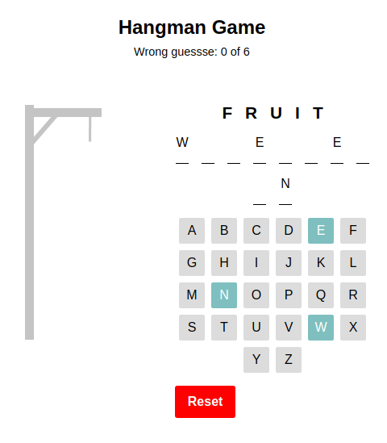
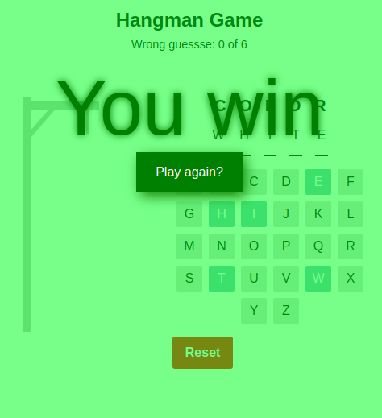
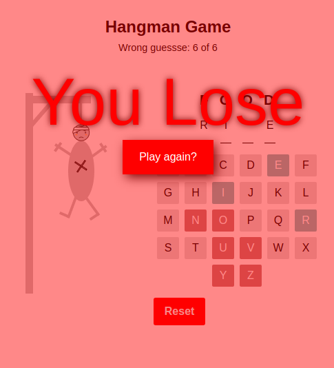

# React-hangman

Hangman Game, Build with react

## How to install

-   Make sure git is installed, [see how to install git](https://www.google.com/search?q=how+to+isntall+git&oq=how+to+isntall+git&aqs=chrome..69i57j0i10l9.4306j0j7&sourceid=chrome&ie=UTF-8).
-   open your terminal or cmd
-   copy this text to terminal "git clone https://github.com/FrhCode/react-hangman.git react-hangman"
-   copy this text to terminal "cd react-hangman"
-   copy this text to terminal "npm run build"
-   it will make new directory, call dist
-   open that folder
-   open file with name index.html

## Galery

